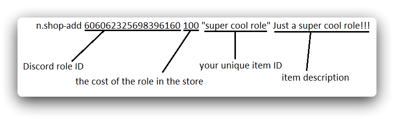

# Naomi's internal economy
Naomi has her own internal economy: getting money, transfers, and a complete role store.

### Basic.
To get the bot's internal currency, there are two commands that give you a bonus once a day and once an hour. Initially, if you just invited Naomi, she uses bonus multipliers and the currency icon is just the `$` symbol. Boring, isn't it? Then let's go over the basic economy setup.

### Naomi's internal currency icon
> **⚖️ Required permissions:**
`MANAGE SERVER`

Set your own currency icon:
```
n.wallet-icon :coin:
```
The above command will set :coin: as Naomi's currency icon. Discord will convert `:coin:` into an emoji, which will become the currency icon.
You can also use custom emoji added to the server, including animated ones, but you cannot use emoji from other servers.
No one forbids the use of plain text as an "icon".
```
n.wallet-icon holy cats
```
"We have a fun currency."

### Setting up bonus multipliers
> **⚖️ Required permissions:**
`MANAGE SERVER`

When you use the commands `n.daily` (once a day) and `n.hourly` (once an hour), then before transferring money to your account, the bot does some calculations based on your current level on the server. Experience and levels for the activity is another topic, so here it will not be discussed.

To switch the use of multipliers bonuses, use the following command:
```
n.payment-multiplier
```
No arguments, just one command, it will turn the multiplier off if it's on and turn it on if it's off.

The bonus multiplier state changes for both bonus commands at once, i.e. for both `n.hourly` and `n.daily.`.

### Manual setting of the payout size
> **⚖️ Required permissions:**
`MANAGE SERVER`

If you are not satisfied with a random payout, and you want to ensure that no extra penny (?) will not fall into the account of the members of your server, then you can set the payout size commands `n.daily` and `n.hourly` yourself.

For `n.hourly` setting the size of the payout looks like this:
```
n.hourly-payment 5
```
The `n.hourly` command will now give out exactly 5 coins. Well, if you have the bonus multiplier turned off, and if turned on, those 5 coins will be multiplied by the member's current level.

Exactly the same with `n.daily':
```
n.daily-payment 15
```
Now `n.daily` will have a fixed payment of 15 coins.

### User balance management
> **⚖️ Required permissions:**
`MANAGE SERVER`

Have you held some kind of event on your server, you have a winner, and you want to reward him by adding a certain amount to his account? Or maybe you want to take some amount of money away from the user?
There is a solution! Balance management commands are ready to help!

Add an amount to the member's balance:
```
n.add-money [@user] [amount]
```
Take away some amount from the member's balance:
```
n.take-money [@user] [amount]
```
Set the member to a certain amount of money:
```
n.set-money [@user] [amount]
```
This is how you can manage the balance of your server members.

### Role Store
>*⚖️ Required permissions:**
`MANAGE SERVER`

Yes, you can indeed sell roles on your server for Naomi currency. It's not hard, and now you'll learn how to do it.

Add an item to the store:
```
n.shop-add <@role> <cost (number)> <your unique item ID> <description...>
```
Yes, this command, or rather its arguments, needs some explanation:
- <@role> - well, everything is clear here, you specify the ID, name (in quotes ""), or a role mention.
- <cost (number)> - the cost of the role in the store, here, too, seems all clear.
- <your unique item ID> - this is more interesting. This ID is what users will enter in the command `n.buy` to buy this role. It must not repeat with the IDs that are already in the store, and no, it's not the role id from Discord. It's your own role ID that you make up yourself.

Details:

Removing an item from the store:
```
n.shop-rem <that unique item ID>
```
It's much simpler here, isn't it?

### Buying items in the store
> **⚖️ Required permissions:**
Available to all.

The following command is used to buy items in the role store:
```
n.buy <unique item ID>
```
It's simple.
