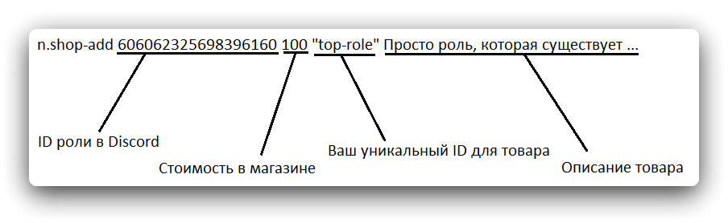

# Внутренняя экономика Наоми
У Наоми присутствует собственная внутренняя экономика: получение денег, переводы, и полноценный магазин ролей.

### Основное
Для получения внутренней валюты бота, существует две команды, которые выдают вам бонус раз в сутки и раз в час. Изначально, если вы только что пригласили Наоми, она использует множители бонусов, а также иконкой валюты является просто символ `$`. Скучно, не правда-ли? Тогда давайте пройдемся по базовой настройке экономики.

### Иконка внутренней валюты Наоми
> **⚖️ Требуемые права:**
`УПРАВЛЕНИЕ СЕРВЕРОМ`

Установка собственной иконки валюты:
```
n.wallet-icon :coin:
```
Вышеуказанная команда установит :coin: в качестве иконки валюты Наоми. Discord преобразует `:coin:` в эмодзи, которое и станет иконкой валюты.
Также вы можете использовать кастомные эмодзи, добавленные на сервер, в том числе и анимированные, однако использовать эмодзи с других серверов нельзя.
Никто не запрещает использовать и обычный текст в роли "иконки".
```
n.wallet-icon святых котов
```
"Веселая у нас валюта."

### Настройка множителей бонусов
> **⚖️ Требуемые права:**
`УПРАВЛЕНИЕ СЕРВЕРОМ`

Когда вы используете команды `n.daily` (раз в сутки) и `n.hourly` (раз в час), то перед передачи на ваш счет денег, бот проводит некоторые вычисления, основываясь на вашем текущем уровне на сервере. Опыт и уровни за активность это уже другая тема, поэтому тут оно упоминаться не будет.

Для переключения использования множителей бонусов, используется следующая команда:
```
n.payment-multiplier
```
Никаких аргументов, просто одна команда, она выключит множитель, если он включен, и, соответственно, включит, если он выключен.

Состояние множителя бонуса меняется сразу для обеих команд получения бонуса, т.е. и для `n.hourly`, и для `n.daily.`.

### Ручная настройка размера выплат
> **⚖️ Требуемые права:**
`УПРАВЛЕНИЕ СЕРВЕРОМ`

Если вас не устраивает рандомная сумма выплат, и вы хотите, чтобы ни одной лишней копейки(?) не попало на счет к участникам вашего сервера, то вы можете установить размер выплат команд `n.daily` и `n.hourly` самостоятельно.

Для `n.hourly` указание размера выплаты выглядит так:
```
n.hourly-payment 5
```
Теперь команда `n.hourly` будет выдавать ровно 5 монет. Ну, если у вас выключен множитель бонуса, а если включен, то эти 5 монет будут умножаться на текущий уровень участника.

Точно также и с `n.daily`:
```
n.daily-payment 15
```
Теперь у `n.daily` будет фиксированная выплата в размере 15 монет.

### Управление балансом пользователей
> **⚖️ Требуемые права:**
`УПРАВЛЕНИЕ СЕРВЕРОМ`

Вы провели какой-то конкурс на своем сервере, у вас есть победитель, и вы хотите наградить его, добавив на его счет определенную сумму? Или, может быть, хотите отобрать у пользователя какую-то сумму?
Решение есть! Команды управления балансом готовы помочь!

Добавить сумму на баланс участника:
```
n.add-money [@пользователь] [сумма]
```
Отобрать у участника какую-то сумму:
```
n.take-money [@пользователь] [сумма]
```
Установить участнику определенную сумму:
```
n.set-money [@пользователь] [сумма]
```
Вот таким образом вы можете управлять балансом участников вашего сервера.

### Магазин ролей
> **⚖️ Требуемые права:**
`УПРАВЛЕНИЕ СЕРВЕРОМ`

Да, вы и вправду можете продавать роли на вашем сервере за валюту Наоми. Это несложно, и сейчас вы узнаете, как это делать.

Добавить предмет в магазин:
```
n.shop-add <@роль> <стоимость(число)> <уникальный ID в магазине> <описание...>
```
Да, эта команда, а точнее ее аргументы, требуют некоторого пояснения:
- <@роль> - ну, тут все понятно, указываете ID, имя (в кавычках ""), или же упоминание роли.
- <стоимость(число)> - стоимость роли в магазине, тут вроде тоже все ясно.
- <уникальный ID в магазине> - вот тут интереснее. Этот ID - это то, что будут вводить пользователи в команде `n.buy` для покупки данной роли. Он не должен повторяться с теми ID, что уже есть в магазине, и нет, это не айди роли из Discord. Это ваш собственный идентификатор роли, который вы придумываете сами.

Подробнее:

Удаление предмета из магазина:
```
n.shop-rem <тот самый уникальный ID предмета>
```
Тут все гораздо проще, верно?

### Покупка предметов в магазине
> **⚖️ Требуемые права:**
Доступно всем.

Для покупки предметов в магазине ролей используется следующая команда:
```
n.buy <уникальный ID предмета>
```
Все просто.
